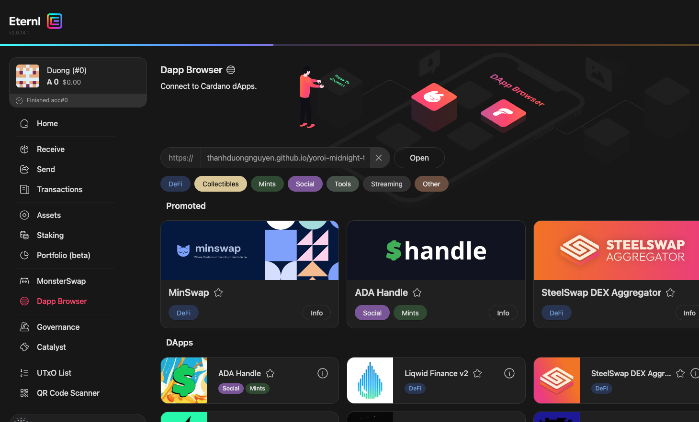

# Với ví Yoroi
1. Truy cập [https://thanhduongnguyen.github.io/yoroi-midnight-transfer/](https://thanhduongnguyen.github.io/yoroi-midnight-transfer/)
2. Điền địa chỉ ví Yoroi người cho và người nhận
3. Tự động mở ví Yoroi để ký message, có thể kiểm tra lại nội dung message trước khi ký, đảm bảo nội dung là "Assign accumulated Scavenger rights to: <địa chỉ ví người nhận>"
4. Sau khi ký xong, bên dưới hiển thị curl command để thực hiện gửi đến Scavenger.
5. Sao chép curl command và chạy trong terminal để hoàn tất quá trình chuyển quyền Scavenger.
6. Nội dung thành công sẽ hiển thị trong terminal.

Lưu ý trình duyệt phải là trình duyệt có ví Yoroi chứa địa chỉ ví người cho, vì sẽ cần kết nối với ví Yoroi để thực hiện ký message. Các ví tạo từ 1 seed vẫn có thể sử dụng được.

# Với ví Eternl
1. Mở Extentsion Eternl
2. Vào phần Dapp Browser
3. Xem hình minh họa bên dưới để biết cách truy cập Dapp Browser trong Eternl:

    
4. Nhập địa chỉ [https://thanhduongnguyen.github.io/yoroi-midnight-transfer/eternl.html](https://thanhduongnguyen.github.io/yoroi-midnight-transfer/eternl.html) vào thanh địa chỉ Dapp Browser và nhấn Open
5. Điền địa chỉ ví Yoroi người cho và người nhận
6. Tự động mở ví Yoroi để ký message, có thể kiểm tra lại nội dung message trước khi ký, đảm bảo nội dung là "Assign accumulated Scavenger rights to: <địa chỉ ví người nhận>"
7. Sau khi ký xong, bên dưới hiển thị curl command để thực hiện gửi đến Scavenger.
8. Sao chép curl command và chạy trong terminal để hoàn tất quá trình chuyển quyền Scavenger.
9. Nội dung thành công sẽ hiển thị trong terminal.